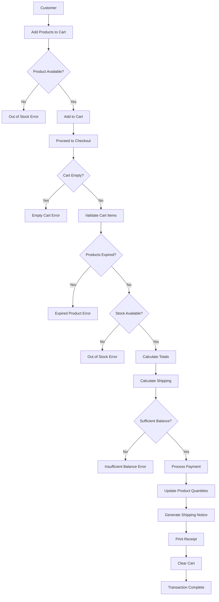
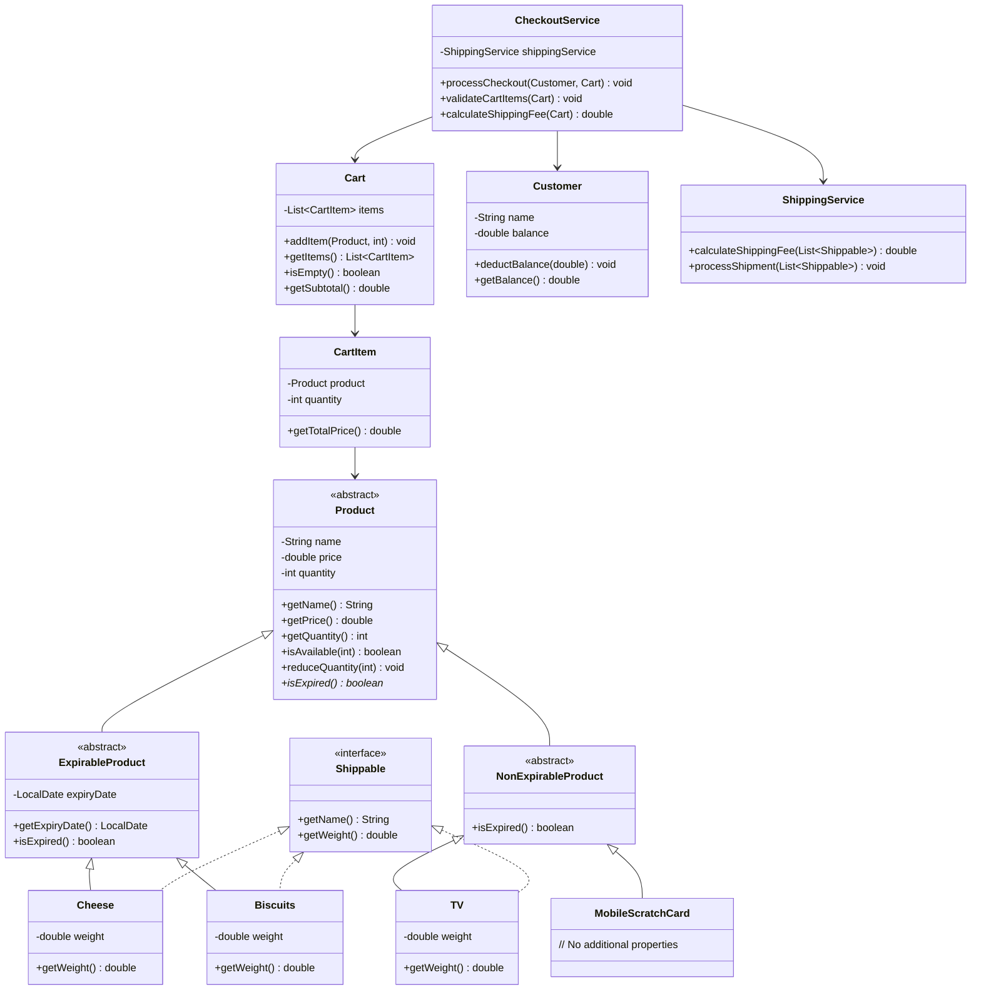

# E-commerce Management System

## 📋 Table of Contents
- Overview
- Features
- System Architecture
- System Flow
- Class Diagram
- Prerequisites
- Installation
- Project Structure
- Usage
- Testing
- Error Handling

## 🎯 Overview

The E-commerce Management System is a comprehensive Java-based application designed to handle product management, cart operations, and checkout processes for an online retail platform. The system implements object-oriented design principles and provides robust error handling for various business scenarios.

### Key Objectives
- Manage inventory with expirable and non-expirable products
- Handle shipping calculations based on product weight
- Process customer orders with comprehensive validation
- Provide clear error messages for exceptional cases
- Maintain data integrity throughout the transaction process

## ✨ Features

### Core Functionality
- **Product Management**: Define products with name, price, and quantity
- **Expiry Management**: Handle products with expiration dates (Cheese, Biscuits)
- **Shipping Integration**: Calculate shipping for physical products based on weight
- **Cart Operations**: Add products with quantity validation
- **Checkout Process**: Complete order processing with payment validation
- **Balance Management**: Handle customer balance deduction
- **Error Handling**: Comprehensive exception management

### Product Types
- **Expirable Products**: Cheese, Biscuits (with expiry dates)
- **Non-Expirable Products**: TV, Mobile Scratch Cards
- **Shippable Products**: Items requiring physical delivery (with weight)
- **Digital Products**: Items with no shipping requirements

## 🏗️ System Architecture

### Design Patterns
- **Template Method Pattern**: Product hierarchy with abstract base classes
- **Strategy Pattern**: Different shipping strategies for product types
- **Service Layer Pattern**: Business logic separation
- **Interface Segregation**: Shippable interface for shipping-specific operations

### Core Components
1. **Product Layer**: Abstract product hierarchy with concrete implementations
2. **Cart Layer**: Shopping cart management with validation
3. **Service Layer**: Business logic for checkout and shipping
4. **Exception Layer**: Custom exception handling for business rules
5. **Interface Layer**: Contracts for cross-cutting concerns

## 🔄 System Flow



## 📊 Class Diagram



## 🔧 Prerequisites

### System Requirements
- **Operating System**: Ubuntu 18.04+ 
- **Java Version**: OpenJDK 11 or higher (OpenJDK 17 LTS recommended)


## 🚀 Installation

### Ubuntu/Linux Setup
```bash
# Update package manager
sudo apt update

# Install OpenJDK 17
sudo apt install openjdk-17-jdk

# Verify installation
java -version
javac -version
```


## 📁 Project Structure

```
ecommerce-system/
├── src/
│   └── com/
│       └── ecommerce/
│           ├── interfaces/
│           │   └── Shippable.java
│           ├── exception/
│           │   ├── EmptyCartException.java
│           │   ├── ExpiredProductException.java
│           │   ├── InsufficientBalanceException.java
│           │   └── OutOfStockException.java
│           ├── model/
│           │   ├── product/
│           │   │   ├── Product.java
│           │   │   ├── ExpirableProduct.java
│           │   │   ├── NonExpirableProduct.java
│           │   │   ├── Cheese.java
│           │   │   ├── Biscuits.java
│           │   │   ├── TV.java
│           │   │   └── MobileScratchCard.java
│           │   ├── Cart.java
│           │   ├── CartItem.java
│           │   └── Customer.java
│           ├── service/
│           │   ├── CheckoutService.java
│           │   └── ShippingService.java
│           └── ECommerceDemo.java
├── bin/ (generated)
└── README.md
```

## 🎮 Usage

### Quick Start
```bash
# Clone or download the project
git clone <repository-url>
cd ecommerce-system

# Compile the project
javac -d bin -cp src src/com/ecommerce/*.java src/com/ecommerce/*/*.java src/com/ecommerce/*/*/*.java

# Run the demo
java -cp bin com.ecommerce.ECommerceDemo
```


### Example Usage
```java
// Create products
Cheese cheese = new Cheese("Cheese", 100.0, 10, LocalDate.now().plusDays(7), 200.0);
TV tv = new TV("TV", 500.0, 3, 5000.0);

// Create customer and cart
Customer customer = new Customer("John Doe", 1000.0);
Cart cart = new Cart();

// Add items to cart
cart.addItem(cheese, 2);
cart.addItem(tv, 1);

// Process checkout
CheckoutService checkoutService = new CheckoutService();
checkoutService.processCheckout(customer, cart);
```

## 🧪 Testing

### Test Scenarios Covered
1. **Successful Checkout**: Mixed products with shipping
2. **Out of Stock**: Attempting to purchase unavailable quantity
3. **Expired Products**: Validation of product expiry dates
4. **Insufficient Balance**: Customer balance validation
5. **Empty Cart**: Checkout with no items
6. **Digital Products**: Items requiring no shipping

### Running Tests
```bash
# Compile and run demo (includes all test scenarios)
java -cp bin com.ecommerce.ECommerceDemo
```

### Terminal Output

The following screenshots demonstrate the system in action, including successful checkout, error handling for expired products, out-of-stock items, and more.


## ⚠️ Error Handling

### Exception Types
| Exception | Description | Trigger Condition |
|-----------|-------------|-------------------|
| `EmptyCartException` | Cart has no items | Checkout with empty cart |
| `OutOfStockException` | Insufficient inventory | Requested quantity > available |
| `ExpiredProductException` | Product past expiry | Expiry date < current date |
| `InsufficientBalanceException` | Low customer balance | Balance < total amount |

### Error Messages
- Clear, descriptive error messages
- Specific information about the failure
- Suggested actions when applicable

## 🔄 Business Rules

### Product Management
- Products must have positive price and quantity
- Expirable products require valid expiry dates
- Shippable products must have weight > 0

### Cart Operations
- Maximum quantity per item limited by available stock
- Duplicate products consolidate quantities
- Cart validation occurs at checkout

### Checkout Process
1. Cart must not be empty
2. All products must be in stock
3. No expired products allowed
4. Customer balance must cover total amount
5. Product quantities updated after successful payment

### Shipping Rules
- Only shippable products incur shipping fees
- Digital products have zero shipping cost
- Shipping calculated by total weight of all items


### Code Style
- Use meaningful variable and method names
- Keep methods focused on single responsibilities
- Follow Java naming conventions (camelCase, PascalCase)
- Maintain consistent indentation (4 spaces)


## 📋 Future Enhancements

### Planned Features
- **Database Integration**: Persistent storage for products and orders
- **User Authentication**: Customer login and session management
- **Order History**: Track previous purchases
- **Payment Gateway**: Integration with payment processors
- **Inventory Management**: Automated stock level monitoring
- **Admin Panel**: Product and customer management interface

### Technical Improvements
- **Unit Testing**: Comprehensive test coverage with JUnit
- **Configuration Management**: External configuration files
- **Logging**: Structured logging with Log4j
- **API Layer**: RESTful web services
- **Caching**: Performance optimization for product lookup


---

**Version**: 1.0.0    
**Maintainer**: Nehad Said
